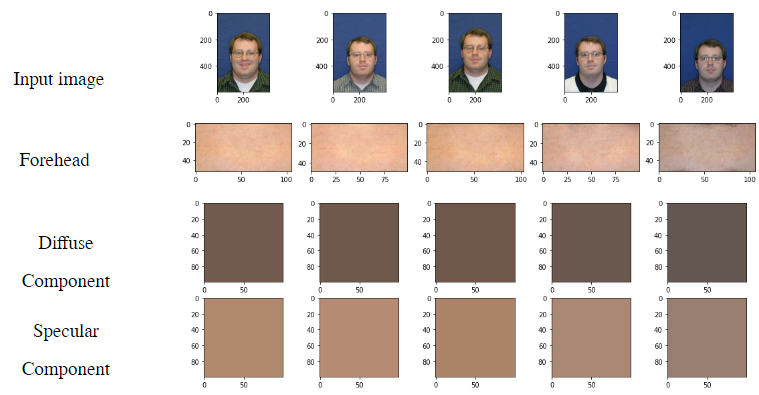

# Skin Reflectance Estimate Based on Dichromatic Separation (SREDS)

Official Repository for Skin Reflectance Estimate Based on Dichromatic Separation (SREDS).




paper: https://arxiv.org/abs/2104.02926

newest paper:

# Installation

```
  git clone /https://github.com/JosephDrahos/SREDS
  cd SREDS/requirements/
  conda env create -f sreds.yml
  conda activate sreds
  pip install -r requirements.txt
```

# Usage

To generate SREDS across a sample dataset (sample_images), run 
```
generateSREDS.ipynb
```

This script will landmark each image in the sample_image directory and generate the SREDS score for each sample image and save the values in a pandas dataframe. 

[](https://colab.research.google.com/JosephDrahos/SREDS/blob/main/generateSREDS_Colab.ipynb)

### Acknowledgements
```sh
Copyright 2023 Clarkson University
```
